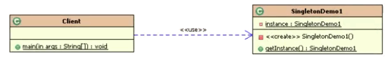

## 什么是单例模式

### 1. 核心作用

保证**一个类只有一个实例**，并提供一个访问它的全局访问点

### 2. 常见应用场景

* **windows中**
  * Windows的 Task Manager (任务管理器)就是很典型的单例模式

  * windows的Recycle Bin (回收站)也是典型的单例应用。在整个系统运行过程中,回收站-直维护着仅有的一个实例。
  * 操作系统的文件系统,也是大的单例模式实现的具体例子, 一个操作系统只能有一个文件系统。

* **Java Servlet**
  * 项目中,读取配置文件的类，一般也只有一个对象。没有必要每次使用配置文件数据,每次new一个对象去读取。
  * 网站的计数器, 一般也是采用单例模式实现,否则难以同步。

  * 数据库连接池的设计一般也是采用单例模式 ,因为数据库连接是一种数据库资源。

  * Application也是单例的典型应用( Servlet编程中会涉及到)

* **框架中**
  * 在Spring中,每个Bean默认就是单例的,这样做的优点是Spring容器可以管理在servlet编程中,每个Servlet也是单例

  * 在spring MVC框架/struts1框架中,控制器对象也是单例
  * 应用程序的日志应用, 一般都何用单例模式实现，这一般是由于共享的日志文件-直处于打开状态,因为只能有一个实例去操作, 否则内容不好追加。

### 3. 优点

> 减少系统性能开销

1. **由于单例模式只生成一个实例， 减少了系统性能开销**,当一个对象的产生需要比较多的资源时,如读取配置、产生其他依赖对象时,则可以通过在应用启动时直接产生一个单例对象,然后永久驻留内存的方式来解决
2. 单例模式可以在系统设置全局的访问点,优化环共享资源访问,例如可以设计一个单例类,负责所有数据表的映射处理


## 常见的单例模式

有五种常见的单例模式, 分别为

* **主要**
  * 饿汉式(线程安全, 调用效率高, 但是, 不能延时加载)
  * 懒汉式(线程安全, 调用效率不高, 但是, 可以延时加载)

* **其他**
  * 双重检测锁式
  * 静态内部类是(线程安全, 调用效率高, 但是, 可以延时加载)
  * 枚举单例(线程安全, 调用效率高, 不能延时加载)

##### 注意

1. 因为是只有一个, 所以不可以创建, 将构造函数私有化
2. 全局访问点, 所以成员变量和方法要用 static来修饰


### 1. 饿汉式

##### 特点

* **优点:** 加载类时, 天然是线程安全的, 调用方法没有同步, 调用效率高
* **缺点:** 单例对象立即加载, 没有延迟加载的优势

##### 注意

1. 构造器私有化
2. 提供一个成员变量, `private static`修饰
3. 提供一个公开的方法, 来获取变量. 只提供一个开放的点

##### 代码

```java
public class Singleton {

    // 2. 类初始化时, 立即加载这个对象(没有延时加载的优势). 加载类时, 天然是线程安全的!
    private static Singleton instance = new Singleton();

    // 1.将构造函数私有化，不可以通过new的方式来创建对象
    private Singleton() {}

    // 3. 返回这个对象, 方法没有同步, 调用效率高
    public static Singleton getInstance() {
        return instance;
    }
}
```


### 2. 懒汉式

##### 特点

* **优点:** lazy load 延迟加载(懒加载), 真正用的时候才加载

  > 单例初始值是null，还未构建，则构建单例对象并返回

* **缺点:** 资源利用率高了(真正用的时候才调用), 但是每次调用 getInstance() 方法都要同步, 并发效率低

##### 注意

1. 使用synchronized为整个方法上锁, 来保证线程安全

##### 代码

```java
public class Singleton {
    // 2. 类初始化时, 先不初始化对象，等用到的时候再创建
    private static Singleton instance;

    // 1.将构造函数私有化
    private Singleton(){}

    // 3. 延时加载(懒加载), 调用到这个方法了，再创建对象
    // 加同步锁, 避免高并发时创建多个对象, 但调用效率低
    public static synchronized Singleton getInstance() {
        // 第二次调用时, 不为空, 不执行
        if (instance == null) {
            instance = new Singleton();
        }
        return instance;
    }
}
```


### 3. 双重检测机制 (Double Check Lock)

##### 与饿汉式对比

将同步内容下方到 if内部, 提高了执行的效率, 不必每次获取对象是都要进行同步, 只有第一次才同步.创建了以后就没必要了

##### 注意

1. 双重检索机制如何保证线程安全的原理

   * 为了防止 new Singleton被执行多次，因此在new操作之前加上Synchronized 同步锁，**锁住整个类（注意，这里不能使用对象锁）。**
   * 进入Synchronized 临界区以后，还要再做一次判空。因为当两个线程同时访问的时候，线程A构建完对象，线程B也已经通过了最初的判空验证，不做第二次判空的话，线程B还是会再次构建instance对象。

2. 成员变量使用 volatile来防止指令重排

   > 指令重排可能导致 instance 未完成初始化, 而线程B就返回 instance.造成空指针异常. 

##### 代码

```java
public class Singleton {

    private Singleton() {}

    private static volatile Singleton instance = null;

    // 静态工厂方法
    public static Singleton getInstance() {
        // 双重检测机制
        if (instance == null) {
            // 同步锁, 使用类 Class来上锁
            synchronized (Singleton.class) {
                // 双重检测机制, 防止两个线程同时进入
                if (instance == null) {
                    instance = new Singleton();
                }
            }
        }
        return instance;
    }
}
```


### 4. 静态内部类实现

##### 特点

1. 只创建一个实例对象(基本)

   > 从外部无法访问静态内部类 LazyHolder，只有当调用Singleton.getInstance方法的时候，才能得到单例对象instance

2. 懒加载

   > instance对象初始化的时机并不是在单例类Singleton被加载的时候，而是**在调用getInstance方法，**使得静态内部类LazyHolder被加载的时候。所以是延迟加载

3. 线程安全, 调用效率高

   > 加载方式是利用 **classloader的加载机制**，主动只用这个类的时候再进行加载, 并保证构建单例的线程安全

###### 代码

```java
public class Singleton {
	// 静态内部类中进行定义, 线程安全, 懒加载
    private static class SingletonClassInstance {
        private static final Singleton instance = new Singleton();
    }

    private void Singleton() {}
    // 方法没有同步, 调用效率高
    private static Singleton getInstance() {
        // 调用静态方法中的成员变量
        return SingletonClassInstance.instance;
    }
}
```


### 5. 枚举实现单例模式

##### 特点

* **优点**
  * 实现简单
  * 枚举本身就是单例模式, 由 JVM从根本上提供保证, 避免通过反射和反序列化的漏铜

* **缺点:** 不能延迟加载

##### 代码

```java
public enum Singleton {
    // 这个枚举元素, 本身就是单例对象
    INSTANCE;

    // 添加自己的操作
    public void singletonOperation() {
    }
}
```


### 6. 测试

```java
public class Client {
    public static void main(String[] args) {
        Singleton s1 = Singleton.getInstance();
        Singleton s2 = Singleton.getInstance();
        System.out.println(s1 == s2);
    }
}
```


## 五种模式的比较

#### 单例模式图



#### 比较

| 单例模式实现 | 线程安全 | 延时加载 | 占用资源 | 防反射构建 |
| ------------ | -------- | -------- | -------- | ---------- |
| 饿汉式       | 是       | 否       | 少       | 否         |
| 懒汉式       | 是       | 是       | 多(用锁) | 否         |
| 双重检测锁   | 是       | 是       | 多(用锁) | 否         |
| 静态内部类   | 是       | 是       | 多       | 否         |
| 枚举         | 是       | 否       | 少       | 是         |

####  如何选用

- **不需要延时加载时(单例对象占用资源少):** 枚举式好于饿汉式

- **需要延时加载(单例对象占用资源大):** 静态内部类 好于 懒汉式


## 问题

### 1. 反射问题

反射可以破解上面几种(不包括枚举) 

###### 代码

```java
public static void main(String[] args) throws Exception {
    Singleton s1 = Singleton.getInstance();
    Singleton s2 = Singleton.getInstance();
    System.out.println(s1);
    System.out.println(s2);
    System.out.println("=========================");
    
    Class<Singleton> clazz = (Class<Singleton>) Class.forName("GOF23.single.Singleton");

    Constructor<Singleton> c = clazz.getDeclaredConstructor(null);
    // 跳过私有检查
    c.setAccessible(true);

    Singleton s3 = c.newInstance();
    Singleton s4 = c.newInstance();

    System.out.println(s3);
    System.out.println(s4);
}
```

###### 结果

```
GOF23.single.Singleton@14ae5a5
GOF23.single.Singleton@14ae5a5
=========================
GOF23.single.Singleton@7f31245a
GOF23.single.Singleton@6d6f6e28
```

#### 解决

在构造方法中手动抛出异常控制

```java
public class Singleton {

    private static Singleton instance = null;
    private Singleton(){
        // 第二次调用是抛出异常
        if (instance != null){
            throw new RuntimeException();
        }
    }

    public static synchronized Singleton getInstance() {
        if (instance == null) {
            instance = new Singleton();
        }
        return instance;
    }
}
```

### 2. 反序列化

反序列话可以破解上面几种(不包括枚举) 实现方式

#### 破解

###### 代码

```java
public static void main(String[] args) throws Exception {
    Singleton s1 = Singleton.getInstance();
    Singleton s2 = Singleton.getInstance();

    System.out.println(s1);
    System.out.println(s2);

    // 序列化测试
    // 存入到文件中
    FileOutputStream fos = new FileOutputStream("e:\\za\\app.txt");
    ObjectOutputStream oos = new ObjectOutputStream(fos);
    oos.writeObject(s1);
    oos.close();
    fos.close();

    // 读出后
    ObjectInputStream ois = new ObjectInputStream(new FileInputStream("e:\\za\\app.txt"));
    Singleton s3 = (Singleton)ois.readObject();
    System.out.println(s3);
}
```

###### 结果

```
GOF23.single.Singleton@14ae5a5
GOF23.single.Singleton@14ae5a5
GOF23.single.Singleton@16b98e56
```

#### 解决

可以通过定义 readResolve() 防止获得不同的对象

```java
public class Singleton implements Serializable {

    private static Singleton instance = null;
    private Singleton() {
    }

    public static synchronized Singleton getInstance() {
        if (instance == null) {
            instance = new Singleton();
        }
        return instance;
    }

    // 反序列化时, 如果定义了 readResolve, 则直接返回此方法指定的对象
    private  Object readResolve() throws ObjectStreamException {
        return instance;
    }
}
```

## 效率测试

#### 代码

```java
public class Client3 {

    public static void main(String[] args) throws Exception {
        long start = System.currentTimeMillis();
        final CountDownLatch countDownLatch = new CountDownLatch(10);

        // 启动十个线程
        for (int i = 0; i < 10; i++) {
            new Thread(new Runnable() {
                @Override
                public void run() {
                    for (int i = 0; i < 100000; i++) {
                        // 变换不同模式的单例模式
                        Object o = Singleton.getInstance();
//                        Object o = Singleton.INSTANCE;

                    }
                    countDownLatch.countDown();
                }
            }).start();
        }
        
        countDownLatch.await();
        long end = System.currentTimeMillis();
        System.out.println("总耗时: " + (end - start));
    }
}
```

