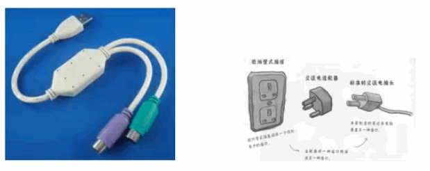

# 适配器模式( adapter pattern)

### 生活中的场景



### 什么是适配器模式?

 将一个类的接口转换成客户端所希望的另一个接口，Adapter模式使用原本由于接口不兼容而不能在一起工作的那些类可以在一起工作

### 模式中的角色：

* 目标接口（Target）：客户所期待的接口，目标可以是具体的或者抽象的类，也可以是接口。
* 需要适配的类（Adaptee）：需要适配的类或者适配者类。
* 适配器（Adapter）：通过包装一个需要适配的对象，把原接口转换成目标接口。

如图


### 代码实现

###### 客户端

```java
// 客户端类, 相当于例子中的笔记本, 只有 USB接口
public class Client {
    public void test1(Target t) {
        t.handleReq();
    }
}
```

###### 目标接口

```java
// 接口, 相当于例子中的 USB接口
public interface Target {
    // 用来处理请求
    void handleReq();
}
```

###### 需要适配的类(键盘)

```java
// 被适配的类， 相当于例子中的 PS/2接口的键盘
public class Key {
    public void request() {
        System.out.println("可以完成客户所需要的功能， 可以打字！");
    }
}
```

###### 适配器

```java
// 适配器一(类适配器方式), 相当于 USB和ps/2的转接器
public class Adapter extends Key implements Target{
    @Override
    public void handleReq() {
        super.request();
    }
}

// 适配器二(对象适配器方式, 使用类组合的方式跟被适配器对象整合), 相当于 USB和ps/2的转接器
public class Adapter implements Target {
    private Key key;
    public Adapter(Key key) {
        this.key = key;
    }

    @Override
    public void handleReq() {
        key.request();
    }
}
```

###### 测试

```java
// 测试
public class Main {
    public static void main(String[] args) {
        Client computer = new Client();
        Key key = new Key();

//        Target t = new Adapter();     // 对应适配器一
        Target t = new Adapter(key);    // 对应适配器二
        computer.test1(t);
    }
}
```

###### 结果

```
可以完成客户所需要的功能， 可以打字！
```


### 工作中的场景

* 经常用来做旧系统改造和升级

* 如果我们的系统开发之后再也不需要维护,那么很多模式都是没必要的,但是不幸的是,事实却是维护一个系统的代价往往是开发一个系统的数倍。

### 我们学习中见过的场景

字节流转为字符流

* `java.io.InputStreamReader(InputStream)`
* ` java.io.OutputStreamWriter(OutputStream)`