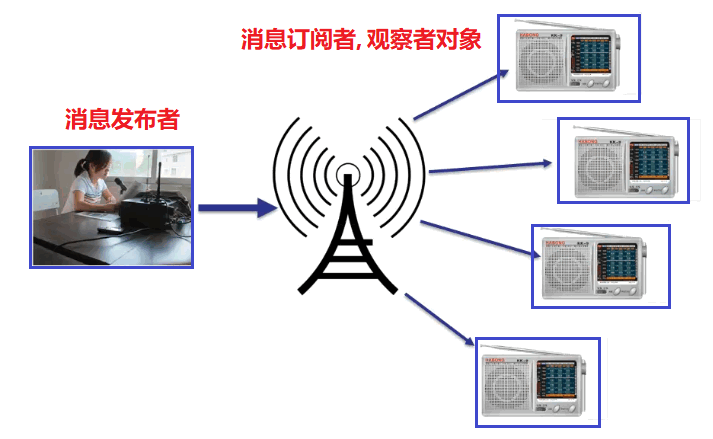

## 观察者模式

广播机制的核心, 需要群体广播模式, 可以用观察者模式



### 场景

* 聊天室程序的创建。服务器创建好后, A,B,C 3个客户端连上来公开聊天。A向服务器发送数据,服务器端聊天数据改变。我们希望将这些聊天数据分别发给其他在线的客户。也就是说,每个客户端需要更新服务器端得数据。
* 网站上,很多人订阅了”java主题”的新闻。当有这个主题新闻时,就会将这些新闻发给所有订阅的人。
* 大家一起玩CS游戏时,服务器需要将每个人的方位变化发给所有的客户。

​	上面这些场景 ,我们都可以使用观察者模式来处理。我们可以把**多个订阅者、客户称之为观察者**;需要同步给多个订阅者的数据封装到对象中,**称之为目标。**


### 核心

* 观察者模式主要用于`1 : N`的通知。当一个对象**(目标对象Subject或Observable)**的状态变化时,**即消息发布**,他需要及时告知一系列对象**(观察者对象,Observer)** ,令他们做出响应, 即消息订阅

* 通知观察者的方式

  * **推:** 每次都会把通知以广播方式发送给所有观察者,所有观察者只能被动接收。
  * **拉:** 观察者只要直到有情况即可。至于什么时候获取内容,获取什么内容都可以自主决定。

  > 就像商家给你发短信, 一定会收到, 但是看不看消息, 什么时候看, 都由你决定


### 代码实现

###### 目标对象

```java
// 接口
public class Subject {
    // protected 便于子类操作
    protected List<Observer> list = new ArrayList<>();

    // 注册, 添加观察者
    public void registerObs(Observer obs) {
        list.add(obs);
    }

    // 删除观察者
    public void removeObs(Observer obs) {
        list.remove(obs);
    }

    // 通知所有观察者更新状态
    public void notifyAllObs() {
        for (Observer obs : list) {
            obs.update(this);
        }
    }
}

// subject实现类
public class ConcreteSubject extends Subject{

    private int state;

    public int getState() {
        return state;
    }

    public void setState(int state) {
        this.state = state;
        // 目标对象值发生变化, 通知所有观察者
        this.notifyAllObs();
    }
}
```

###### 观察者

```java
// 观察者接口
public interface Observer {
    void update(Subject subject);
}

// 实现类
public class ObserverA implements Observer {

    private int myState;    // myState需要和目标对象的 state保持一致

    @Override
    public void update(Subject subject) {
        myState = ((ConcreteSubject)subject).getState();
    }

    public int getMyState() {
        return myState;
    }

    public void setMyState(int myState) {
        this.myState = myState;
    }
}
```

###### 测试

```java
public class Client {
    public static void main(String[] args) {
        // 目标对象
        ConcreteSubject subject = new ConcreteSubject();
        // 创建多个观察者
        ObserverA obs1 = new ObserverA();
        ObserverA obs2 = new ObserverA();
        ObserverA obs3 = new ObserverA();
        // 将这三个观察者添加到 subject对象的观察者队伍中
        subject.registerObs(obs1);
        subject.registerObs(obs2);
        subject.registerObs(obs3);

        // 改变 subject的状态
        subject.setState(3000);
        // 查看观察者的状态
        System.out.println("进行修改");
        System.out.println(obs1.getMyState());
        System.out.println(obs2.getMyState());
        System.out.println(obs3.getMyState());
    }
}
```

###### 结果

```java
进行修改
3000
3000
3000
```


JAVASE提供了 `java.util.Observable`和`java.util.Observer`来实现观察者模式

### 代码

###### 目标对象

```java
public class ObserverA implements Observer {

    private int myState;

    @Override
    public void update(Observable o, Object arg) {
        myState = ((ConcreteSubject)o).getState();
    }

    public int getMyState() {
        return myState;
    }

    public void setMyState(int myState) {
        this.myState = myState;
    }
}
```

###### 观察者

```java
public class ConcreteSubject extends Observable {

    private int state;

    public void setState(int state) {
        this.state = state; // 目标对象的状态发生了变化
        setChanged();       // 对象已经做了值更改
        notifyObservers();  // 通知所有的对象
    }

    public int getState() {
        return state;
    }
}
```

###### 测试

```java
public class Client {
    public static void main(String[] args) {
        // 目标对象
        ConcreteSubject subject = new ConcreteSubject();
        // 创建多个观察者
        ObserverA obs1 = new ObserverA();
        ObserverA obs2 = new ObserverA();
        ObserverA obs3 = new ObserverA();
        // 将这三个观察者添加到 subject对象的观察者队伍中
        subject.addObserver(obs1);
        subject.addObserver(obs2);
        subject.addObserver(obs3);

        // 改变 subject的状态
        subject.setState(3000);
        // 查看观察者的状态
        System.out.println("状态进行修改------------------");
        System.out.println(obs1.getMyState());
        System.out.println(obs2.getMyState());
        System.out.println(obs3.getMyState());
        subject.setState(3000);

        subject.setState(800);
        System.out.println("状态进行修改------------------");
        System.out.println(obs1.getMyState());
        System.out.println(obs2.getMyState());
        System.out.println(obs3.getMyState());
    }
}
```

###### 结果

```
状态进行修改------------------
3000
3000
3000
状态进行修改------------------
800
800
800
```


###  开发中常见的场景

需要群发消息的时候

* 聊天室程序的,服务器转发给所有客户端
* 网络游戏(多人联机对战)场景中 ,服务器将客户端的状态进行分发
* 邮件订阅

  - Servlet中 ,监听器的实现一Android中 ,广播机制
  - JDK的AWT中事件处理模型基于观察者模式的委派事件模型(Delegation Event Model)

    - 事件源 — 标对象
    - 事件监听器 — 观察者
- 京东商城中,群发某商品打折信息